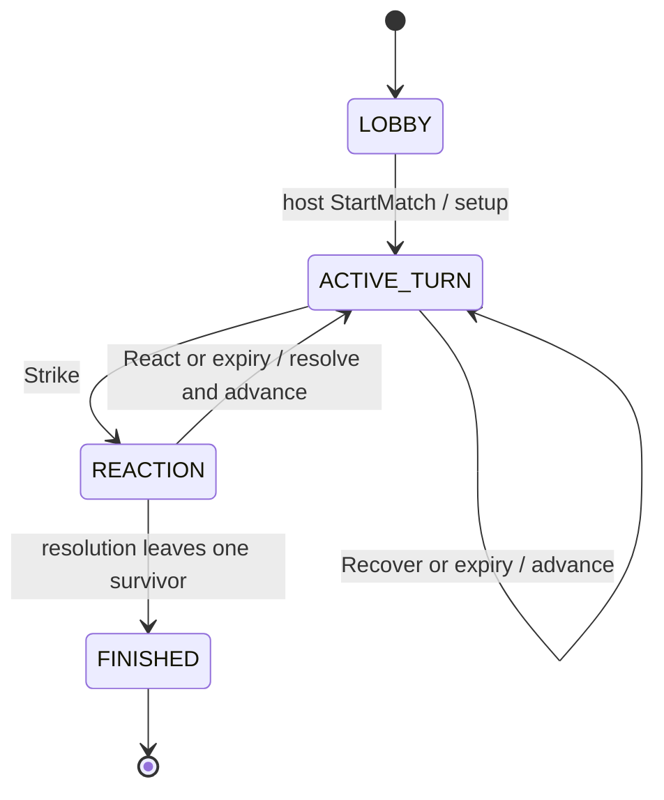

# Match state machine

Only input-waiting and terminal states persist. Room lobby is an application state; the three match phases are domain state. Setup, reveal, resolution, victory check, and round rollover are atomic operations/events, not waiting phases.

## State contracts

| State / purpose | Allowed commands | Validation | Transition and events | Timeout |
| --- | --- | --- | --- | --- |
| LOBBY: assemble roster | CreateRoom (entry), JoinRoom, LeaveRoom, StartMatch; read/reconnect | Authenticated membership for member operations; capacity 6; unique seat; start by host with 2–6 connected members; serialized room update | RoomCreated/PlayerJoined/PlayerLeft/HostChanged application notifications. Start builds domain state: MatchStarted, RoundStarted, TurnStarted -> ACTIVE_TURN | No gameplay timer. Empty-room cleanup belongs to application. |
| ACTIVE_TURN: one player chooses | Strike, Recover; internal ExpirePhase | Current living actor, correct phase token/revision; Strike funding 0/1, living non-self target and affordable commitment; Recover below cap | Strike: ActionCommitted -> REACTION. Recover: PowerRecovered, TurnEnded, optional RoundEnded/RoundStarted, TurnStarted -> ACTIVE_TURN | 45 seconds; ExpirePhase emits TurnPassed then the same turn-advance events; no Power gain. |
| REACTION: target responds to concealed Strike | React; internal ExpirePhase | Current living target, correct token/revision, valid choice; Guard affordable. Commitment cannot be revised | ReactionCommitted, ActionRevealed, AttackResolved, optional BluffSucceeded, optional PlayerEliminated, TurnEnded; then VictoryAchieved -> FINISHED or advance events -> ACTIVE_TURN | 20 seconds; ExpirePhase resolves as Yield with timeout reason. |
| FINISHED: immutable result | Read/reconnect only | Caller has room membership for view; gameplay commands rejected | No outgoing gameplay transition; no further round/turn events | None. Rematch later creates a new MatchId; it never resets this state. |

Read/GetView and reconnect do not alter domain state and are available in all room states. Leave during a match is a disconnection, not roster mutation. Start on an already started room is rejected (a retry with the same command ID returns its original receipt).

## Automatic advancement

After nonterminal TurnEnded, move to the next living unconsumed queued player. If none remain, emit RoundEnded, increment round, rebuild queue from surviving fixed seat order, emit RoundStarted, then TurnStarted. On terminal resolution emit VictoryAchieved immediately after TurnEnded and do not emit RoundEnded or open another turn. The winning partial round stays partial.

Each entry to an input-waiting phase gets a new deterministic phase token derived from match ID and transition revision (setup uses revision 0). The application attaches a deadline to this token when committing the transition. Rejected commands and reconnects cannot replace it.

## Deadline and concurrency contract

One application queue serializes every mutation for a room, including start, gameplay, and timer delivery. At dequeue, use an injected Clock to check the active deadline before evaluating a fresh player command. At `now >= deadline`, apply the recorded internal ExpirePhase first; the late command is then rejected as stale. At `now < deadline`, the valid player command wins. Processing order, not client timestamps, is authoritative.

Deduplication lookup precedes deadline processing: an exact retry returns the original receipt without reapplying effects. A command ID reused with different input is rejected. Timer callbacks carry the phase token; stale callbacks do nothing. Re-arm timers from current state, never from client activity. Tests advance a fake clock; domain replay applies recorded expiries with no clock.

Commit state, deadline metadata, command receipt, journal entry, and event batch before notifying clients. Reveal animation plays the returned ordered batch; client acknowledgements never gate match advancement. If an event is missed, the next projected snapshot restores authoritative state. Animation duration must not silently change the next deadline.
